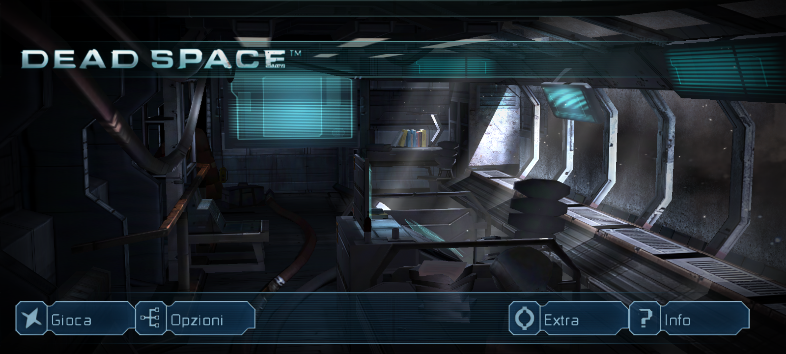
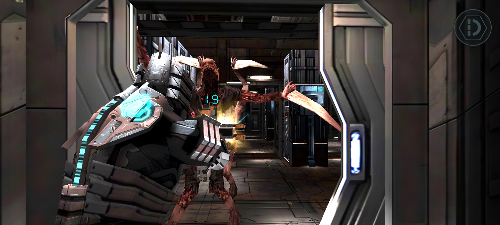
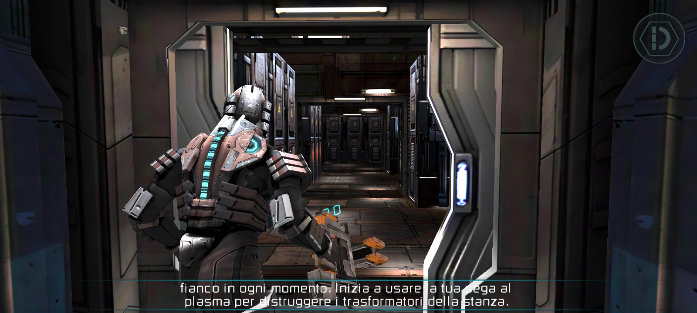
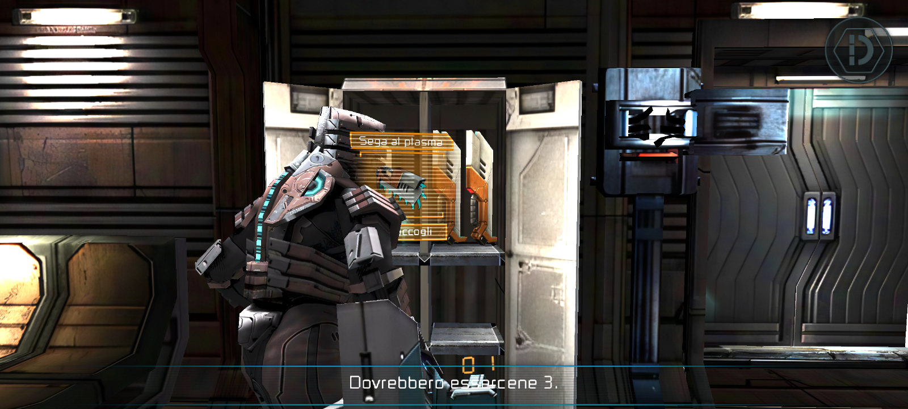
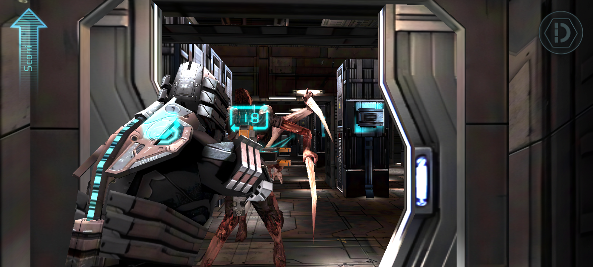

# Dead Space Reanimated

> **Disclaimer.** Dead Space and all of its content belong to Electronic Arts. This is a non-commercial fan project, made out of love for the title.
> The original mobile game was pulled from every store years ago and it is not available online except in internet archives. No longer works on modern phones. For this reason the complete APK is published here directly.
> If this release bothers anyone, it can be removed right away and replaced by a simple mod for the original game files. Feel free to [contact me](https://github.com/GINESTR0/DeadSpaceReanimated/issues).

**The complete remastered of Dead Space Sabotage, the 2011 mobile game, rebuilt to run on today's 64-bit Android phones.**
**REMASTERED BY GINESTRO**

Dead Space Reanimated brings it back with native resolution on any screen, HD textures, 60 fps, sound and controls rebuilt for today's phones (mine a Fold8 works magestically), and the bugs of the original binary fixed.

[**Download here the latest release**](https://github.com/GINESTR0/DeadSpaceReanimated/releases/latest)

## WHAT IS "REMASTERED"

- **Built for 64-bit Android phone** from Android 8.0 onward, with the upscaled HD textures loaded in the format each GPU accepts (Snapdragon, Exynos, Tensor, MediaTek).
- **Native resolution, 4x antialiasing, 16x anisotropic filtering, 60 fps** with even frame pacing on high refresh rate screens.
- **HD remastered of every texture**: environments and characters at 2x, interface, HUD and logos at 4x. Crisp subtitles and menus.
- **Rebuilt sound**: more effects at the same time, complete reload sounds in step with the animation.
- **Touch controls tuned for today's screens**, free look, motion controls working as in 2011.
- **Foldables supported**: open or close the phone mid-game and the picture keeps its proportions.
- **8 languages**, following the phone's language: English, Italian, French, German, Spanish, Japanese, Korean, Chinese.
- **No permissions, no internet access, no ads, no tracking.** The app asks for nothing.

## What was done to remaster it

### New 2011 engine
- The original game engine runs unmodified inside a custom runtime that translates its 32-bit ARM code to 64-bit on the fly. The game logic, levels and story are exactly the 2011 ones.
- Everything the old engine expected from a 2011 phone is provided by the runtime: graphics, sound, touch, motion sensor, storage and lifecycle on current Android versions.
- The original 32-bit-only package can no longer be installed; this one is a native 64-bit app aligned for the latest Android memory requirements.

### Graphics
- Rendering at the screen's native resolution instead of the small 2011 resolutions, with 4x multisample antialiasing.
- 16x anisotropic and trilinear filtering on every texture with mipmaps, for sharp floors and walls at any angle.
- A complete HD texture pack: all the game's textures rebuilt at 2x, the interface and HUD at 4x, with the interface atlases cleaned of stray colored pixels.
- Subtitles, menus and HUD text drawn from glyphs rebuilt at high resolution, instead of the blurry upscaled 2011 text.
- Pickup holograms rendered in high resolution and in proportion, complete on every screen shape.
- Achievement notifications drawn at the right size on high-resolution screens.
- Screen-wide lens flares removed, the HUD center reticle hidden: the laser sight of the weapon is enough.
- Frames delivered in step with the display, so every frame stays on screen for the same time on 60 and 120 Hz phones.

### Sound
- Up to 6 sound effects at the same time. The original kept only 4 and silently dropped the rest, gunshots included; now, when all are busy, the oldest one gives way to the new one.
- Complete reload sounds for every weapon. The original played only the first part; now the rest plays when Isaac actually inserts the new clip, in step with the animation.
- Footsteps slightly quieter and never the same sample twice in a row.
- Low-latency audio output for current Android versions.

### Controls
- Interaction circles respond on their whole drawn area, not only in the middle.
- Tap and double-tap tolerances scaled to the screen, so quick turns and taps register on high-resolution phones.
- Look sensitivity retuned for large, dense screens; the slider starts at 50% with a much wider range.
- Free look: the camera stays where you put it instead of recentering by itself, and the locator no longer shows up on its own when you stand still.
- Motion sensor wired up: the plasma cutter beam rotates when you tilt the phone while aiming, as in 2011.
- The Back button is handled by the game instead of closing it. Fullscreen immersive mode.

### Fixes to the original game ports
- Dismemberment: severed limbs could turn into giant polygons stretched across the screen, a defect of the original binary that modern GPUs made visible. Fixed.
- Reload sounds cut short and effects dropped when several played at once. Fixed.

### Phone and storage
- Foldables and different aspect ratios: the game keeps its proportions when you open or close the device.
- The HD textures load in the format each GPU accepts.
- Saves are included in Android's automatic backup, and future updates install over this version keeping them.

## Requirements

- Android 8.0 or newer, 64-bit phone or tablet (virtually every phone of the last years: Galaxy S, Z Fold and Z Flip, Pixel and many more).
- About 1.4 GB of free storage: 715 MB for the APK, the same again for the game files unpacked on first launch.

## Install

1. Download `DeadSpaceReanimated-1.2.apk` from the [latest release](https://github.com/GINESTR0/DeadSpaceReanimated/releases/latest) on the phone, or copy it there. That file is all you need: the "Source code" files GitHub adds to every release contain only this page.
2. Open it. Android will ask you to allow installs from this source.
3. Launch "Dead Space Reanimated". The first launch unpacks the game files, then the game starts.
4. Play. Headphones recommended.

## Saves

Saves live in `Android/data/com.deadspace.reanimated/files/appdata/var/` and are removed if you uninstall the app. They are included in Android's automatic backup, so with a Google account backup they come back after a reinstall or on a new phone.

## Contact

Problems, ideas, or a phone where the game does not run well -> [Open an issue](https://github.com/GINESTR0/DeadSpaceReanimated/issues).

---

Fan project, not affiliated with or endorsed by Electronic Arts. Dead Space is a trademark of Electronic Arts Inc.
